<!-- markdownlint-capture -->
<!-- markdownlint-disable -->

# Code Metrics

This file is dynamically maintained by a bot, *please do not* edit this by hand. It represents various [code metrics](https://aka.ms/dotnet/code-metrics), such as cyclomatic complexity, maintainability index, and so on.

<div id='productfetcher-fetchcli'></div>

## ProductFetcher.FetchCli :heavy_check_mark:

The *ProductFetcher.FetchCli.csproj* project file contains:

- 1 namespaces.
- 2 named types.
- 82 total lines of source code.
- Approximately 28 lines of executable code.
- The highest cyclomatic complexity is 1 :heavy_check_mark:.

<details>
<summary>
  <strong id="global+namespace">
    &lt;global namespace&gt; :heavy_check_mark:
  </strong>
</summary>
<br>

The `<global namespace>` namespace contains 2 named types.

- 2 named types.
- 82 total lines of source code.
- Approximately 28 lines of executable code.
- The highest cyclomatic complexity is 1 :heavy_check_mark:.

<details>
<summary>
  <strong id="program$">
    &lt;Program&gt;$ :heavy_check_mark:
  </strong>
</summary>
<br>

- The `<Program>$` contains 1 members.
- 56 total lines of source code.
- Approximately 22 lines of executable code.
- The highest cyclomatic complexity is 1 :heavy_check_mark:.

| Member kind | Line number | Maintainability index | Cyclomatic complexity | Depth of inheritance | Class coupling | Lines of source / executable code |
| :-: | :-: | :-: | :-: | :-: | :-: | :-: |
| Method | <a href='https://github.com/dominikus1993/argo-rossmann-product-fetcher/blob/main/src/Cli/ProductFetcher.FetchCli/Program.cs#L1' title='<top-level-statements-entry-point>'>1</a> | 64 | 1 :heavy_check_mark: | 0 | 4 | 56 / 11 |

<a href="#global+namespace">:top: back to &lt;global namespace&gt;</a>

</details>

<details>
<summary>
  <strong id="loggingfilter">
    LoggingFilter :heavy_check_mark:
  </strong>
</summary>
<br>

- The `LoggingFilter` contains 3 members.
- 26 total lines of source code.
- Approximately 6 lines of executable code.
- The highest cyclomatic complexity is 1 :heavy_check_mark:.

| Member kind | Line number | Maintainability index | Cyclomatic complexity | Depth of inheritance | Class coupling | Lines of source / executable code |
| :-: | :-: | :-: | :-: | :-: | :-: | :-: |
| Field | <a href='https://github.com/dominikus1993/argo-rossmann-product-fetcher/blob/main/src/Cli/ProductFetcher.FetchCli/Program.cs#L33' title='ILogger LoggingFilter._logger'>33</a> | 100 | 0 :heavy_check_mark: | 0 | 1 | 1 / 0 |
| Method | <a href='https://github.com/dominikus1993/argo-rossmann-product-fetcher/blob/main/src/Cli/ProductFetcher.FetchCli/Program.cs#L35' title='LoggingFilter.LoggingFilter(ILogger<LoggingFilter> logger)'>35</a> | 96 | 1 :heavy_check_mark: | 0 | 2 | 4 / 1 |
| Method | <a href='https://github.com/dominikus1993/argo-rossmann-product-fetcher/blob/main/src/Cli/ProductFetcher.FetchCli/Program.cs#L39' title='ValueTask<int> LoggingFilter.OnCommandExecutionAsync(CoconaCommandExecutingContext ctx, CommandExecutionDelegate next)'>39</a> | 73 | 1 :heavy_check_mark: | 0 | 6 | 17 / 5 |

<a href="#LoggingFilter-class-diagram">:link: to `LoggingFilter` class diagram</a>

<a href="#global+namespace">:top: back to &lt;global namespace&gt;</a>

</details>

</details>

<a href="#productfetcher-fetchcli">:top: back to ProductFetcher.FetchCli</a>

<div id='productfetcher-notifycli'></div>

## ProductFetcher.NotifyCli :heavy_check_mark:

The *ProductFetcher.NotifyCli.csproj* project file contains:

- 1 namespaces.
- 1 named types.
- 2 total lines of source code.
- Approximately 2 lines of executable code.
- The highest cyclomatic complexity is 1 :heavy_check_mark:.

<details>
<summary>
  <strong id="global+namespace">
    &lt;global namespace&gt; :heavy_check_mark:
  </strong>
</summary>
<br>

The `<global namespace>` namespace contains 1 named types.

- 1 named types.
- 2 total lines of source code.
- Approximately 2 lines of executable code.
- The highest cyclomatic complexity is 1 :heavy_check_mark:.

<details>
<summary>
  <strong id="program$">
    &lt;Program&gt;$ :heavy_check_mark:
  </strong>
</summary>
<br>

- The `<Program>$` contains 1 members.
- 2 total lines of source code.
- Approximately 2 lines of executable code.
- The highest cyclomatic complexity is 1 :heavy_check_mark:.

| Member kind | Line number | Maintainability index | Cyclomatic complexity | Depth of inheritance | Class coupling | Lines of source / executable code |
| :-: | :-: | :-: | :-: | :-: | :-: | :-: |
| Method | <a href='https://github.com/dominikus1993/argo-rossmann-product-fetcher/blob/main/src/Cli/ProductFetcher.NotifyCli/Program.cs#L2' title='<top-level-statements-entry-point>'>2</a> | 100 | 1 :heavy_check_mark: | 0 | 1 | 2 / 1 |

<a href="#global+namespace">:top: back to &lt;global namespace&gt;</a>

</details>

</details>

<a href="#productfetcher-notifycli">:top: back to ProductFetcher.NotifyCli</a>

<div id='productfetcher-core'></div>

## ProductFetcher.Core :heavy_check_mark:

The *ProductFetcher.Core.csproj* project file contains:

- 4 namespaces.
- 6 named types.
- 80 total lines of source code.
- Approximately 16 lines of executable code.
- The highest cyclomatic complexity is 2 :heavy_check_mark:.

<details>
<summary>
  <strong id="productfetcher-core-dto">
    ProductFetcher.Core.Dto :heavy_check_mark:
  </strong>
</summary>
<br>

The `ProductFetcher.Core.Dto` namespace contains 1 named types.

- 1 named types.
- 25 total lines of source code.
- Approximately 0 lines of executable code.
- The highest cyclomatic complexity is 2 :heavy_check_mark:.

<details>
<summary>
  <strong id="rossmannproductdto">
    RossmannProductDto :heavy_check_mark:
  </strong>
</summary>
<br>

- The `RossmannProductDto` contains 19 members.
- 23 total lines of source code.
- Approximately 0 lines of executable code.
- The highest cyclomatic complexity is 2 :heavy_check_mark:.

| Member kind | Line number | Maintainability index | Cyclomatic complexity | Depth of inheritance | Class coupling | Lines of source / executable code |
| :-: | :-: | :-: | :-: | :-: | :-: | :-: |
| Property | <a href='https://github.com/dominikus1993/argo-rossmann-product-fetcher/blob/main/src/ProductFetcher.Core/Dto/ProductDto.cs#L17' title='string? RossmannProductDto.AGroupNrOld'>17</a> | 100 | 2 :heavy_check_mark: | 0 | 1 | 1 / 0 |
| Property | <a href='https://github.com/dominikus1993/argo-rossmann-product-fetcher/blob/main/src/ProductFetcher.Core/Dto/ProductDto.cs#L10' title='string? RossmannProductDto.Brand'>10</a> | 100 | 2 :heavy_check_mark: | 0 | 1 | 1 / 0 |
| Property | <a href='https://github.com/dominikus1993/argo-rossmann-product-fetcher/blob/main/src/ProductFetcher.Core/Dto/ProductDto.cs#L8' title='string? RossmannProductDto.Caption'>8</a> | 100 | 2 :heavy_check_mark: | 0 | 1 | 1 / 0 |
| Property | <a href='https://github.com/dominikus1993/argo-rossmann-product-fetcher/blob/main/src/ProductFetcher.Core/Dto/ProductDto.cs#L23' title='string? RossmannProductDto.Category'>23</a> | 100 | 2 :heavy_check_mark: | 0 | 1 | 1 / 0 |
| Property | <a href='https://github.com/dominikus1993/argo-rossmann-product-fetcher/blob/main/src/ProductFetcher.Core/Dto/ProductDto.cs#L16' title='string? RossmannProductDto.DANNumber'>16</a> | 100 | 2 :heavy_check_mark: | 0 | 1 | 1 / 0 |
| Property | <a href='https://github.com/dominikus1993/argo-rossmann-product-fetcher/blob/main/src/ProductFetcher.Core/Dto/ProductDto.cs#L21' title='double RossmannProductDto.Depth'>21</a> | 100 | 2 :heavy_check_mark: | 0 | 0 | 1 / 0 |
| Property | <a href='https://github.com/dominikus1993/argo-rossmann-product-fetcher/blob/main/src/ProductFetcher.Core/Dto/ProductDto.cs#L19' title='int RossmannProductDto.Height'>19</a> | 100 | 2 :heavy_check_mark: | 0 | 0 | 1 / 0 |
| Property | <a href='https://github.com/dominikus1993/argo-rossmann-product-fetcher/blob/main/src/ProductFetcher.Core/Dto/ProductDto.cs#L5' title='int RossmannProductDto.Id'>5</a> | 100 | 2 :heavy_check_mark: | 0 | 0 | 1 / 0 |
| Property | <a href='https://github.com/dominikus1993/argo-rossmann-product-fetcher/blob/main/src/ProductFetcher.Core/Dto/ProductDto.cs#L13' title='decimal? RossmannProductDto.LoyaltyPrice'>13</a> | 100 | 2 :heavy_check_mark: | 0 | 2 | 1 / 0 |
| Property | <a href='https://github.com/dominikus1993/argo-rossmann-product-fetcher/blob/main/src/ProductFetcher.Core/Dto/ProductDto.cs#L15' title='string? RossmannProductDto.LoyaltyPricePerUnit'>15</a> | 100 | 2 :heavy_check_mark: | 0 | 1 | 1 / 0 |
| Property | <a href='https://github.com/dominikus1993/argo-rossmann-product-fetcher/blob/main/src/ProductFetcher.Core/Dto/ProductDto.cs#L7' title='string? RossmannProductDto.Name'>7</a> | 100 | 2 :heavy_check_mark: | 0 | 1 | 1 / 0 |
| Property | <a href='https://github.com/dominikus1993/argo-rossmann-product-fetcher/blob/main/src/ProductFetcher.Core/Dto/ProductDto.cs#L6' title='string? RossmannProductDto.NavigateUrl'>6</a> | 100 | 2 :heavy_check_mark: | 0 | 1 | 1 / 0 |
| Property | <a href='https://github.com/dominikus1993/argo-rossmann-product-fetcher/blob/main/src/ProductFetcher.Core/Dto/ProductDto.cs#L11' title='double? RossmannProductDto.OldPrice'>11</a> | 100 | 2 :heavy_check_mark: | 0 | 1 | 1 / 0 |
| Property | <a href='https://github.com/dominikus1993/argo-rossmann-product-fetcher/blob/main/src/ProductFetcher.Core/Dto/ProductDto.cs#L12' title='double RossmannProductDto.Price'>12</a> | 100 | 2 :heavy_check_mark: | 0 | 0 | 1 / 0 |
| Property | <a href='https://github.com/dominikus1993/argo-rossmann-product-fetcher/blob/main/src/ProductFetcher.Core/Dto/ProductDto.cs#L14' title='string? RossmannProductDto.PricePerUnit'>14</a> | 100 | 2 :heavy_check_mark: | 0 | 1 | 1 / 0 |
| Property | <a href='https://github.com/dominikus1993/argo-rossmann-product-fetcher/blob/main/src/ProductFetcher.Core/Dto/ProductDto.cs#L9' title='string? RossmannProductDto.Unit'>9</a> | 100 | 2 :heavy_check_mark: | 0 | 1 | 1 / 0 |
| Property | <a href='https://github.com/dominikus1993/argo-rossmann-product-fetcher/blob/main/src/ProductFetcher.Core/Dto/ProductDto.cs#L18' title='int RossmannProductDto.Vat'>18</a> | 100 | 2 :heavy_check_mark: | 0 | 0 | 1 / 0 |
| Property | <a href='https://github.com/dominikus1993/argo-rossmann-product-fetcher/blob/main/src/ProductFetcher.Core/Dto/ProductDto.cs#L22' title='double RossmannProductDto.Weight'>22</a> | 100 | 2 :heavy_check_mark: | 0 | 0 | 1 / 0 |
| Property | <a href='https://github.com/dominikus1993/argo-rossmann-product-fetcher/blob/main/src/ProductFetcher.Core/Dto/ProductDto.cs#L20' title='int RossmannProductDto.Width'>20</a> | 100 | 2 :heavy_check_mark: | 0 | 0 | 1 / 0 |

<a href="#RossmannProductDto-class-diagram">:link: to `RossmannProductDto` class diagram</a>

<a href="#productfetcher-core-dto">:top: back to ProductFetcher.Core.Dto</a>

</details>

</details>

<details>
<summary>
  <strong id="productfetcher-core-repositories">
    ProductFetcher.Core.Repositories :heavy_check_mark:
  </strong>
</summary>
<br>

The `ProductFetcher.Core.Repositories` namespace contains 2 named types.

- 2 named types.
- 11 total lines of source code.
- Approximately 4 lines of executable code.
- The highest cyclomatic complexity is 1 :heavy_check_mark:.

<details>
<summary>
  <strong id="iproductsreader">
    IProductsReader :heavy_check_mark:
  </strong>
</summary>
<br>

- The `IProductsReader` contains 1 members.
- 4 total lines of source code.
- Approximately 2 lines of executable code.
- The highest cyclomatic complexity is 1 :heavy_check_mark:.

| Member kind | Line number | Maintainability index | Cyclomatic complexity | Depth of inheritance | Class coupling | Lines of source / executable code |
| :-: | :-: | :-: | :-: | :-: | :-: | :-: |
| Method | <a href='https://github.com/dominikus1993/argo-rossmann-product-fetcher/blob/main/src/ProductFetcher.Core/Repositories/IProductsRepository.cs#L12' title='IAsyncEnumerable<RossmannProductDto> IProductsReader.ReadProducts(CancellationToken cancellationToken = null)'>12</a> | 87 | 1 :heavy_check_mark: | 0 | 3 | 1 / 2 |

<a href="#IProductsReader-class-diagram">:link: to `IProductsReader` class diagram</a>

<a href="#productfetcher-core-repositories">:top: back to ProductFetcher.Core.Repositories</a>

</details>

<details>
<summary>
  <strong id="iproductswriter">
    IProductsWriter :heavy_check_mark:
  </strong>
</summary>
<br>

- The `IProductsWriter` contains 1 members.
- 4 total lines of source code.
- Approximately 2 lines of executable code.
- The highest cyclomatic complexity is 1 :heavy_check_mark:.

| Member kind | Line number | Maintainability index | Cyclomatic complexity | Depth of inheritance | Class coupling | Lines of source / executable code |
| :-: | :-: | :-: | :-: | :-: | :-: | :-: |
| Method | <a href='https://github.com/dominikus1993/argo-rossmann-product-fetcher/blob/main/src/ProductFetcher.Core/Repositories/IProductsRepository.cs#L7' title='Task IProductsWriter.WriteProducts(IEnumerable<RossmannProductDto> products, CancellationToken cancellationToken = null)'>7</a> | 87 | 1 :heavy_check_mark: | 0 | 4 | 1 / 2 |

<a href="#IProductsWriter-class-diagram">:link: to `IProductsWriter` class diagram</a>

<a href="#productfetcher-core-repositories">:top: back to ProductFetcher.Core.Repositories</a>

</details>

</details>

<details>
<summary>
  <strong id="productfetcher-core-services">
    ProductFetcher.Core.Services :heavy_check_mark:
  </strong>
</summary>
<br>

The `ProductFetcher.Core.Services` namespace contains 1 named types.

- 1 named types.
- 6 total lines of source code.
- Approximately 2 lines of executable code.
- The highest cyclomatic complexity is 1 :heavy_check_mark:.

<details>
<summary>
  <strong id="irossmannproductsservice">
    IRossmannProductsService :heavy_check_mark:
  </strong>
</summary>
<br>

- The `IRossmannProductsService` contains 1 members.
- 4 total lines of source code.
- Approximately 2 lines of executable code.
- The highest cyclomatic complexity is 1 :heavy_check_mark:.

| Member kind | Line number | Maintainability index | Cyclomatic complexity | Depth of inheritance | Class coupling | Lines of source / executable code |
| :-: | :-: | :-: | :-: | :-: | :-: | :-: |
| Method | <a href='https://github.com/dominikus1993/argo-rossmann-product-fetcher/blob/main/src/ProductFetcher.Core/Services/RossmannProductsService.cs#L7' title='IAsyncEnumerable<RossmannProductDto> IRossmannProductsService.GetProductsInPromotion(CancellationToken cancellationToken = null)'>7</a> | 87 | 1 :heavy_check_mark: | 0 | 3 | 1 / 2 |

<a href="#IRossmannProductsService-class-diagram">:link: to `IRossmannProductsService` class diagram</a>

<a href="#productfetcher-core-services">:top: back to ProductFetcher.Core.Services</a>

</details>

</details>

<details>
<summary>
  <strong id="productfetcher-core-usecases">
    ProductFetcher.Core.UseCases :heavy_check_mark:
  </strong>
</summary>
<br>

The `ProductFetcher.Core.UseCases` namespace contains 2 named types.

- 2 named types.
- 38 total lines of source code.
- Approximately 10 lines of executable code.
- The highest cyclomatic complexity is 1 :heavy_check_mark:.

<details>
<summary>
  <strong id="fetchrossmannproductsusecase">
    FetchRossmannProductsUseCase :heavy_check_mark:
  </strong>
</summary>
<br>

- The `FetchRossmannProductsUseCase` contains 4 members.
- 17 total lines of source code.
- Approximately 5 lines of executable code.
- The highest cyclomatic complexity is 1 :heavy_check_mark:.

| Member kind | Line number | Maintainability index | Cyclomatic complexity | Depth of inheritance | Class coupling | Lines of source / executable code |
| :-: | :-: | :-: | :-: | :-: | :-: | :-: |
| Field | <a href='https://github.com/dominikus1993/argo-rossmann-product-fetcher/blob/main/src/ProductFetcher.Core/UseCases/FetchProductsUseCase.cs#L9' title='IRossmannProductsService FetchRossmannProductsUseCase._productsService'>9</a> | 100 | 0 :heavy_check_mark: | 0 | 1 | 1 / 0 |
| Field | <a href='https://github.com/dominikus1993/argo-rossmann-product-fetcher/blob/main/src/ProductFetcher.Core/UseCases/FetchProductsUseCase.cs#L10' title='IProductsWriter FetchRossmannProductsUseCase._productsWriter'>10</a> | 100 | 0 :heavy_check_mark: | 0 | 1 | 1 / 0 |
| Method | <a href='https://github.com/dominikus1993/argo-rossmann-product-fetcher/blob/main/src/ProductFetcher.Core/UseCases/FetchProductsUseCase.cs#L12' title='FetchRossmannProductsUseCase.FetchRossmannProductsUseCase(IRossmannProductsService productsService, IProductsWriter productsWriter)'>12</a> | 85 | 1 :heavy_check_mark: | 0 | 2 | 5 / 2 |
| Method | <a href='https://github.com/dominikus1993/argo-rossmann-product-fetcher/blob/main/src/ProductFetcher.Core/UseCases/FetchProductsUseCase.cs#L18' title='Task FetchRossmannProductsUseCase.Execute(CancellationToken cancellationToken = null)'>18</a> | 77 | 1 :heavy_check_mark: | 0 | 7 | 5 / 3 |

<a href="#FetchRossmannProductsUseCase-class-diagram">:link: to `FetchRossmannProductsUseCase` class diagram</a>

<a href="#productfetcher-core-usecases">:top: back to ProductFetcher.Core.UseCases</a>

</details>

<details>
<summary>
  <strong id="notifycustomeraboutpromotionsusecase">
    NotifyCustomerAboutPromotionsUseCase :heavy_check_mark:
  </strong>
</summary>
<br>

- The `NotifyCustomerAboutPromotionsUseCase` contains 4 members.
- 17 total lines of source code.
- Approximately 5 lines of executable code.
- The highest cyclomatic complexity is 1 :heavy_check_mark:.

| Member kind | Line number | Maintainability index | Cyclomatic complexity | Depth of inheritance | Class coupling | Lines of source / executable code |
| :-: | :-: | :-: | :-: | :-: | :-: | :-: |
| Field | <a href='https://github.com/dominikus1993/argo-rossmann-product-fetcher/blob/main/src/ProductFetcher.Core/UseCases/NotifyCustomerAboutPromotions.cs#L9' title='IRossmannProductsService NotifyCustomerAboutPromotionsUseCase._productsService'>9</a> | 100 | 0 :heavy_check_mark: | 0 | 1 | 1 / 0 |
| Field | <a href='https://github.com/dominikus1993/argo-rossmann-product-fetcher/blob/main/src/ProductFetcher.Core/UseCases/NotifyCustomerAboutPromotions.cs#L10' title='IProductsWriter NotifyCustomerAboutPromotionsUseCase._productsWriter'>10</a> | 100 | 0 :heavy_check_mark: | 0 | 1 | 1 / 0 |
| Method | <a href='https://github.com/dominikus1993/argo-rossmann-product-fetcher/blob/main/src/ProductFetcher.Core/UseCases/NotifyCustomerAboutPromotions.cs#L12' title='NotifyCustomerAboutPromotionsUseCase.NotifyCustomerAboutPromotionsUseCase(IRossmannProductsService productsService, IProductsWriter productsWriter)'>12</a> | 85 | 1 :heavy_check_mark: | 0 | 2 | 5 / 2 |
| Method | <a href='https://github.com/dominikus1993/argo-rossmann-product-fetcher/blob/main/src/ProductFetcher.Core/UseCases/NotifyCustomerAboutPromotions.cs#L18' title='Task NotifyCustomerAboutPromotionsUseCase.Execute(CancellationToken cancellationToken = null)'>18</a> | 77 | 1 :heavy_check_mark: | 0 | 7 | 5 / 3 |

<a href="#NotifyCustomerAboutPromotionsUseCase-class-diagram">:link: to `NotifyCustomerAboutPromotionsUseCase` class diagram</a>

<a href="#productfetcher-core-usecases">:top: back to ProductFetcher.Core.UseCases</a>

</details>

</details>

<a href="#productfetcher-core">:top: back to ProductFetcher.Core</a>

<div id='productfetcher-infrastructure'></div>

## ProductFetcher.Infrastructure :heavy_check_mark:

The *ProductFetcher.Infrastructure.csproj* project file contains:

- 5 namespaces.
- 10 named types.
- 147 total lines of source code.
- Approximately 35 lines of executable code.
- The highest cyclomatic complexity is 7 :heavy_check_mark:.

<details>
<summary>
  <strong id="productfetcher-infrastructure-api">
    ProductFetcher.Infrastructure.Api :heavy_check_mark:
  </strong>
</summary>
<br>

The `ProductFetcher.Infrastructure.Api` namespace contains 1 named types.

- 1 named types.
- 8 total lines of source code.
- Approximately 2 lines of executable code.
- The highest cyclomatic complexity is 1 :heavy_check_mark:.

<details>
<summary>
  <strong id="iproductsapi">
    IProductsApi :heavy_check_mark:
  </strong>
</summary>
<br>

- The `IProductsApi` contains 1 members.
- 5 total lines of source code.
- Approximately 2 lines of executable code.
- The highest cyclomatic complexity is 1 :heavy_check_mark:.

| Member kind | Line number | Maintainability index | Cyclomatic complexity | Depth of inheritance | Class coupling | Lines of source / executable code |
| :-: | :-: | :-: | :-: | :-: | :-: | :-: |
| Method | <a href='https://github.com/dominikus1993/argo-rossmann-product-fetcher/blob/main/src/ProductFetcher.Infrastructure/Api/IProductsApi.cs#L7' title='Task<RossmannApiResponse<ApiProductData>> IProductsApi.GetProducts(int page)'>7</a> | 93 | 1 :heavy_check_mark: | 0 | 4 | 2 / 2 |

<a href="#IProductsApi-class-diagram">:link: to `IProductsApi` class diagram</a>

<a href="#productfetcher-infrastructure-api">:top: back to ProductFetcher.Infrastructure.Api</a>

</details>

</details>

<details>
<summary>
  <strong id="productfetcher-infrastructure-dto">
    ProductFetcher.Infrastructure.Dto :heavy_check_mark:
  </strong>
</summary>
<br>

The `ProductFetcher.Infrastructure.Dto` namespace contains 3 named types.

- 3 named types.
- 35 total lines of source code.
- Approximately 0 lines of executable code.
- The highest cyclomatic complexity is 2 :heavy_check_mark:.

<details>
<summary>
  <strong id="apiproductdata">
    ApiProductData :heavy_check_mark:
  </strong>
</summary>
<br>

- The `ApiProductData` contains 3 members.
- 6 total lines of source code.
- Approximately 0 lines of executable code.
- The highest cyclomatic complexity is 2 :heavy_check_mark:.

| Member kind | Line number | Maintainability index | Cyclomatic complexity | Depth of inheritance | Class coupling | Lines of source / executable code |
| :-: | :-: | :-: | :-: | :-: | :-: | :-: |
| Property | <a href='https://github.com/dominikus1993/argo-rossmann-product-fetcher/blob/main/src/ProductFetcher.Infrastructure/Dto/ProductResponse.cs#L10' title='List<ApiProductDto>? ApiProductData.Products'>10</a> | 100 | 2 :heavy_check_mark: | 0 | 3 | 1 / 0 |
| Property | <a href='https://github.com/dominikus1993/argo-rossmann-product-fetcher/blob/main/src/ProductFetcher.Infrastructure/Dto/ProductResponse.cs#L12' title='int ApiProductData.TotalCount'>12</a> | 100 | 2 :heavy_check_mark: | 0 | 0 | 1 / 0 |
| Property | <a href='https://github.com/dominikus1993/argo-rossmann-product-fetcher/blob/main/src/ProductFetcher.Infrastructure/Dto/ProductResponse.cs#L11' title='int ApiProductData.TotalPages'>11</a> | 100 | 2 :heavy_check_mark: | 0 | 0 | 1 / 0 |

<a href="#ApiProductData-class-diagram">:link: to `ApiProductData` class diagram</a>

<a href="#productfetcher-infrastructure-dto">:top: back to ProductFetcher.Infrastructure.Dto</a>

</details>

<details>
<summary>
  <strong id="apiproductdto">
    ApiProductDto :heavy_check_mark:
  </strong>
</summary>
<br>

- The `ApiProductDto` contains 19 members.
- 22 total lines of source code.
- Approximately 0 lines of executable code.
- The highest cyclomatic complexity is 2 :heavy_check_mark:.

| Member kind | Line number | Maintainability index | Cyclomatic complexity | Depth of inheritance | Class coupling | Lines of source / executable code |
| :-: | :-: | :-: | :-: | :-: | :-: | :-: |
| Property | <a href='https://github.com/dominikus1993/argo-rossmann-product-fetcher/blob/main/src/ProductFetcher.Infrastructure/Dto/ProductResponse.cs#L29' title='string? ApiProductDto.AGroupNrOld'>29</a> | 100 | 2 :heavy_check_mark: | 0 | 1 | 1 / 0 |
| Property | <a href='https://github.com/dominikus1993/argo-rossmann-product-fetcher/blob/main/src/ProductFetcher.Infrastructure/Dto/ProductResponse.cs#L22' title='string? ApiProductDto.Brand'>22</a> | 100 | 2 :heavy_check_mark: | 0 | 1 | 1 / 0 |
| Property | <a href='https://github.com/dominikus1993/argo-rossmann-product-fetcher/blob/main/src/ProductFetcher.Infrastructure/Dto/ProductResponse.cs#L20' title='string? ApiProductDto.Caption'>20</a> | 100 | 2 :heavy_check_mark: | 0 | 1 | 1 / 0 |
| Property | <a href='https://github.com/dominikus1993/argo-rossmann-product-fetcher/blob/main/src/ProductFetcher.Infrastructure/Dto/ProductResponse.cs#L35' title='string? ApiProductDto.Category'>35</a> | 100 | 2 :heavy_check_mark: | 0 | 1 | 1 / 0 |
| Property | <a href='https://github.com/dominikus1993/argo-rossmann-product-fetcher/blob/main/src/ProductFetcher.Infrastructure/Dto/ProductResponse.cs#L28' title='string? ApiProductDto.DANNumber'>28</a> | 100 | 2 :heavy_check_mark: | 0 | 1 | 1 / 0 |
| Property | <a href='https://github.com/dominikus1993/argo-rossmann-product-fetcher/blob/main/src/ProductFetcher.Infrastructure/Dto/ProductResponse.cs#L33' title='double ApiProductDto.Depth'>33</a> | 100 | 2 :heavy_check_mark: | 0 | 0 | 1 / 0 |
| Property | <a href='https://github.com/dominikus1993/argo-rossmann-product-fetcher/blob/main/src/ProductFetcher.Infrastructure/Dto/ProductResponse.cs#L31' title='int ApiProductDto.Height'>31</a> | 100 | 2 :heavy_check_mark: | 0 | 0 | 1 / 0 |
| Property | <a href='https://github.com/dominikus1993/argo-rossmann-product-fetcher/blob/main/src/ProductFetcher.Infrastructure/Dto/ProductResponse.cs#L17' title='int ApiProductDto.Id'>17</a> | 100 | 2 :heavy_check_mark: | 0 | 0 | 1 / 0 |
| Property | <a href='https://github.com/dominikus1993/argo-rossmann-product-fetcher/blob/main/src/ProductFetcher.Infrastructure/Dto/ProductResponse.cs#L25' title='decimal? ApiProductDto.LoyaltyPrice'>25</a> | 100 | 2 :heavy_check_mark: | 0 | 2 | 1 / 0 |
| Property | <a href='https://github.com/dominikus1993/argo-rossmann-product-fetcher/blob/main/src/ProductFetcher.Infrastructure/Dto/ProductResponse.cs#L27' title='string? ApiProductDto.LoyaltyPricePerUnit'>27</a> | 100 | 2 :heavy_check_mark: | 0 | 1 | 1 / 0 |
| Property | <a href='https://github.com/dominikus1993/argo-rossmann-product-fetcher/blob/main/src/ProductFetcher.Infrastructure/Dto/ProductResponse.cs#L19' title='string? ApiProductDto.Name'>19</a> | 100 | 2 :heavy_check_mark: | 0 | 1 | 1 / 0 |
| Property | <a href='https://github.com/dominikus1993/argo-rossmann-product-fetcher/blob/main/src/ProductFetcher.Infrastructure/Dto/ProductResponse.cs#L18' title='string? ApiProductDto.NavigateUrl'>18</a> | 100 | 2 :heavy_check_mark: | 0 | 1 | 1 / 0 |
| Property | <a href='https://github.com/dominikus1993/argo-rossmann-product-fetcher/blob/main/src/ProductFetcher.Infrastructure/Dto/ProductResponse.cs#L23' title='double? ApiProductDto.OldPrice'>23</a> | 100 | 2 :heavy_check_mark: | 0 | 1 | 1 / 0 |
| Property | <a href='https://github.com/dominikus1993/argo-rossmann-product-fetcher/blob/main/src/ProductFetcher.Infrastructure/Dto/ProductResponse.cs#L24' title='double ApiProductDto.Price'>24</a> | 100 | 2 :heavy_check_mark: | 0 | 0 | 1 / 0 |
| Property | <a href='https://github.com/dominikus1993/argo-rossmann-product-fetcher/blob/main/src/ProductFetcher.Infrastructure/Dto/ProductResponse.cs#L26' title='string? ApiProductDto.PricePerUnit'>26</a> | 100 | 2 :heavy_check_mark: | 0 | 1 | 1 / 0 |
| Property | <a href='https://github.com/dominikus1993/argo-rossmann-product-fetcher/blob/main/src/ProductFetcher.Infrastructure/Dto/ProductResponse.cs#L21' title='string? ApiProductDto.Unit'>21</a> | 100 | 2 :heavy_check_mark: | 0 | 1 | 1 / 0 |
| Property | <a href='https://github.com/dominikus1993/argo-rossmann-product-fetcher/blob/main/src/ProductFetcher.Infrastructure/Dto/ProductResponse.cs#L30' title='int ApiProductDto.Vat'>30</a> | 100 | 2 :heavy_check_mark: | 0 | 0 | 1 / 0 |
| Property | <a href='https://github.com/dominikus1993/argo-rossmann-product-fetcher/blob/main/src/ProductFetcher.Infrastructure/Dto/ProductResponse.cs#L34' title='double ApiProductDto.Weight'>34</a> | 100 | 2 :heavy_check_mark: | 0 | 0 | 1 / 0 |
| Property | <a href='https://github.com/dominikus1993/argo-rossmann-product-fetcher/blob/main/src/ProductFetcher.Infrastructure/Dto/ProductResponse.cs#L32' title='int ApiProductDto.Width'>32</a> | 100 | 2 :heavy_check_mark: | 0 | 0 | 1 / 0 |

<a href="#ApiProductDto-class-diagram">:link: to `ApiProductDto` class diagram</a>

<a href="#productfetcher-infrastructure-dto">:top: back to ProductFetcher.Infrastructure.Dto</a>

</details>

<details>
<summary>
  <strong id="rossmannapiresponset">
    RossmannApiResponse&lt;T&gt; :heavy_check_mark:
  </strong>
</summary>
<br>

- The `RossmannApiResponse<T>` contains 1 members.
- 4 total lines of source code.
- Approximately 0 lines of executable code.
- The highest cyclomatic complexity is 2 :heavy_check_mark:.

| Member kind | Line number | Maintainability index | Cyclomatic complexity | Depth of inheritance | Class coupling | Lines of source / executable code |
| :-: | :-: | :-: | :-: | :-: | :-: | :-: |
| Property | <a href='https://github.com/dominikus1993/argo-rossmann-product-fetcher/blob/main/src/ProductFetcher.Infrastructure/Dto/ProductResponse.cs#L5' title='T? RossmannApiResponse<T>.Data'>5</a> | 100 | 2 :heavy_check_mark: | 0 | 0 | 1 / 0 |

<a href="#RossmannApiResponse&lt;T&gt;-class-diagram">:link: to `RossmannApiResponse&lt;T&gt;` class diagram</a>

<a href="#productfetcher-infrastructure-dto">:top: back to ProductFetcher.Infrastructure.Dto</a>

</details>

</details>

<details>
<summary>
  <strong id="productfetcher-infrastructure-extensions">
    ProductFetcher.Infrastructure.Extensions :heavy_check_mark:
  </strong>
</summary>
<br>

The `ProductFetcher.Infrastructure.Extensions` namespace contains 1 named types.

- 1 named types.
- 28 total lines of source code.
- Approximately 10 lines of executable code.
- The highest cyclomatic complexity is 1 :heavy_check_mark:.

<details>
<summary>
  <strong id="iocextensions">
    IocExtensions :heavy_check_mark:
  </strong>
</summary>
<br>

- The `IocExtensions` contains 1 members.
- 26 total lines of source code.
- Approximately 10 lines of executable code.
- The highest cyclomatic complexity is 1 :heavy_check_mark:.

| Member kind | Line number | Maintainability index | Cyclomatic complexity | Depth of inheritance | Class coupling | Lines of source / executable code |
| :-: | :-: | :-: | :-: | :-: | :-: | :-: |
| Method | <a href='https://github.com/dominikus1993/argo-rossmann-product-fetcher/blob/main/src/ProductFetcher.Infrastructure/Extensions/IocExtensions.cs#L18' title='IServiceCollection IocExtensions.AddInfrastructure(IServiceCollection services, IConfiguration configuration)'>18</a> | 64 | 1 :heavy_check_mark: | 0 | 8 | 23 / 10 |

<a href="#IocExtensions-class-diagram">:link: to `IocExtensions` class diagram</a>

<a href="#productfetcher-infrastructure-extensions">:top: back to ProductFetcher.Infrastructure.Extensions</a>

</details>

</details>

<details>
<summary>
  <strong id="productfetcher-infrastructure-repositories">
    ProductFetcher.Infrastructure.Repositories :heavy_check_mark:
  </strong>
</summary>
<br>

The `ProductFetcher.Infrastructure.Repositories` namespace contains 4 named types.

- 4 named types.
- 49 total lines of source code.
- Approximately 15 lines of executable code.
- The highest cyclomatic complexity is 3 :heavy_check_mark:.

<details>
<summary>
  <strong id="fileproductsreader">
    FileProductsReader :heavy_check_mark:
  </strong>
</summary>
<br>

- The `FileProductsReader` contains 4 members.
- 24 total lines of source code.
- Approximately 9 lines of executable code.
- The highest cyclomatic complexity is 3 :heavy_check_mark:.

| Member kind | Line number | Maintainability index | Cyclomatic complexity | Depth of inheritance | Class coupling | Lines of source / executable code |
| :-: | :-: | :-: | :-: | :-: | :-: | :-: |
| Field | <a href='https://github.com/dominikus1993/argo-rossmann-product-fetcher/blob/main/src/ProductFetcher.Infrastructure/Repositories/FileProductsWriter.cs#L35' title='FileProductsReaderConfig FileProductsReader._config'>35</a> | 100 | 0 :heavy_check_mark: | 0 | 1 | 1 / 0 |
| Field | <a href='https://github.com/dominikus1993/argo-rossmann-product-fetcher/blob/main/src/ProductFetcher.Infrastructure/Repositories/FileProductsWriter.cs#L36' title='JsonSerializerOptions FileProductsReader._jsonOptions'>36</a> | 100 | 0 :heavy_check_mark: | 0 | 1 | 1 / 0 |
| Method | <a href='https://github.com/dominikus1993/argo-rossmann-product-fetcher/blob/main/src/ProductFetcher.Infrastructure/Repositories/FileProductsWriter.cs#L37' title='FileProductsReader.FileProductsReader(FileProductsReaderConfig config, JsonSerializerOptions jsonOptions)'>37</a> | 85 | 1 :heavy_check_mark: | 0 | 2 | 5 / 2 |
| Method | <a href='https://github.com/dominikus1993/argo-rossmann-product-fetcher/blob/main/src/ProductFetcher.Infrastructure/Repositories/FileProductsWriter.cs#L43' title='IAsyncEnumerable<RossmannProductDto> FileProductsReader.ReadProducts(CancellationToken cancellationToken = null)'>43</a> | 67 | 3 :heavy_check_mark: | 0 | 9 | 13 / 7 |

<a href="#FileProductsReader-class-diagram">:link: to `FileProductsReader` class diagram</a>

<a href="#productfetcher-infrastructure-repositories">:top: back to ProductFetcher.Infrastructure.Repositories</a>

</details>

<details>
<summary>
  <strong id="fileproductsreaderconfig">
    FileProductsReaderConfig :heavy_check_mark:
  </strong>
</summary>
<br>

- The `FileProductsReaderConfig` contains 3 members.
- 1 total lines of source code.
- Approximately 0 lines of executable code.
- The highest cyclomatic complexity is 1 :heavy_check_mark:.

| Member kind | Line number | Maintainability index | Cyclomatic complexity | Depth of inheritance | Class coupling | Lines of source / executable code |
| :-: | :-: | :-: | :-: | :-: | :-: | :-: |
| Method | <a href='https://github.com/dominikus1993/argo-rossmann-product-fetcher/blob/main/src/ProductFetcher.Infrastructure/Repositories/FileProductsWriter.cs#L31' title='FileProductsReaderConfig.FileProductsReaderConfig(string Path, string FileName)'>31</a> | 100 | 1 :heavy_check_mark: | 0 | 0 | 1 / 0 |
| Property | <a href='https://github.com/dominikus1993/argo-rossmann-product-fetcher/blob/main/src/ProductFetcher.Infrastructure/Repositories/FileProductsWriter.cs#L31' title='string FileProductsReaderConfig.FileName'>31</a> | 100 | 0 :heavy_check_mark: | 0 | 0 | 1 / 0 |
| Property | <a href='https://github.com/dominikus1993/argo-rossmann-product-fetcher/blob/main/src/ProductFetcher.Infrastructure/Repositories/FileProductsWriter.cs#L31' title='string FileProductsReaderConfig.Path'>31</a> | 100 | 0 :heavy_check_mark: | 0 | 0 | 1 / 0 |

<a href="#FileProductsReaderConfig-class-diagram">:link: to `FileProductsReaderConfig` class diagram</a>

<a href="#productfetcher-infrastructure-repositories">:top: back to ProductFetcher.Infrastructure.Repositories</a>

</details>

<details>
<summary>
  <strong id="fileproductswriter">
    FileProductsWriter :heavy_check_mark:
  </strong>
</summary>
<br>

- The `FileProductsWriter` contains 4 members.
- 18 total lines of source code.
- Approximately 6 lines of executable code.
- The highest cyclomatic complexity is 1 :heavy_check_mark:.

| Member kind | Line number | Maintainability index | Cyclomatic complexity | Depth of inheritance | Class coupling | Lines of source / executable code |
| :-: | :-: | :-: | :-: | :-: | :-: | :-: |
| Field | <a href='https://github.com/dominikus1993/argo-rossmann-product-fetcher/blob/main/src/ProductFetcher.Infrastructure/Repositories/FileProductsWriter.cs#L14' title='FileProductsWriterConfig FileProductsWriter._config'>14</a> | 100 | 0 :heavy_check_mark: | 0 | 1 | 1 / 0 |
| Field | <a href='https://github.com/dominikus1993/argo-rossmann-product-fetcher/blob/main/src/ProductFetcher.Infrastructure/Repositories/FileProductsWriter.cs#L15' title='JsonSerializerOptions FileProductsWriter._jsonOptions'>15</a> | 100 | 0 :heavy_check_mark: | 0 | 1 | 1 / 0 |
| Method | <a href='https://github.com/dominikus1993/argo-rossmann-product-fetcher/blob/main/src/ProductFetcher.Infrastructure/Repositories/FileProductsWriter.cs#L17' title='FileProductsWriter.FileProductsWriter(FileProductsWriterConfig config, JsonSerializerOptions jsonOptions)'>17</a> | 85 | 1 :heavy_check_mark: | 0 | 2 | 5 / 2 |
| Method | <a href='https://github.com/dominikus1993/argo-rossmann-product-fetcher/blob/main/src/ProductFetcher.Infrastructure/Repositories/FileProductsWriter.cs#L23' title='Task FileProductsWriter.WriteProducts(IEnumerable<RossmannProductDto> products, CancellationToken cancellationToken = null)'>23</a> | 73 | 1 :heavy_check_mark: | 0 | 7 | 6 / 4 |

<a href="#FileProductsWriter-class-diagram">:link: to `FileProductsWriter` class diagram</a>

<a href="#productfetcher-infrastructure-repositories">:top: back to ProductFetcher.Infrastructure.Repositories</a>

</details>

<details>
<summary>
  <strong id="fileproductswriterconfig">
    FileProductsWriterConfig :heavy_check_mark:
  </strong>
</summary>
<br>

- The `FileProductsWriterConfig` contains 3 members.
- 1 total lines of source code.
- Approximately 0 lines of executable code.
- The highest cyclomatic complexity is 1 :heavy_check_mark:.

| Member kind | Line number | Maintainability index | Cyclomatic complexity | Depth of inheritance | Class coupling | Lines of source / executable code |
| :-: | :-: | :-: | :-: | :-: | :-: | :-: |
| Method | <a href='https://github.com/dominikus1993/argo-rossmann-product-fetcher/blob/main/src/ProductFetcher.Infrastructure/Repositories/FileProductsWriter.cs#L10' title='FileProductsWriterConfig.FileProductsWriterConfig(string Path, string FileName)'>10</a> | 100 | 1 :heavy_check_mark: | 0 | 0 | 1 / 0 |
| Property | <a href='https://github.com/dominikus1993/argo-rossmann-product-fetcher/blob/main/src/ProductFetcher.Infrastructure/Repositories/FileProductsWriter.cs#L10' title='string FileProductsWriterConfig.FileName'>10</a> | 100 | 0 :heavy_check_mark: | 0 | 0 | 1 / 0 |
| Property | <a href='https://github.com/dominikus1993/argo-rossmann-product-fetcher/blob/main/src/ProductFetcher.Infrastructure/Repositories/FileProductsWriter.cs#L10' title='string FileProductsWriterConfig.Path'>10</a> | 100 | 0 :heavy_check_mark: | 0 | 0 | 1 / 0 |

<a href="#FileProductsWriterConfig-class-diagram">:link: to `FileProductsWriterConfig` class diagram</a>

<a href="#productfetcher-infrastructure-repositories">:top: back to ProductFetcher.Infrastructure.Repositories</a>

</details>

</details>

<details>
<summary>
  <strong id="productfetcher-infrastructure-services">
    ProductFetcher.Infrastructure.Services :heavy_check_mark:
  </strong>
</summary>
<br>

The `ProductFetcher.Infrastructure.Services` namespace contains 1 named types.

- 1 named types.
- 27 total lines of source code.
- Approximately 8 lines of executable code.
- The highest cyclomatic complexity is 7 :heavy_check_mark:.

<details>
<summary>
  <strong id="httprossmannproductsservice">
    HttpRossmannProductsService :heavy_check_mark:
  </strong>
</summary>
<br>

- The `HttpRossmannProductsService` contains 3 members.
- 25 total lines of source code.
- Approximately 8 lines of executable code.
- The highest cyclomatic complexity is 7 :heavy_check_mark:.

| Member kind | Line number | Maintainability index | Cyclomatic complexity | Depth of inheritance | Class coupling | Lines of source / executable code |
| :-: | :-: | :-: | :-: | :-: | :-: | :-: |
| Field | <a href='https://github.com/dominikus1993/argo-rossmann-product-fetcher/blob/main/src/ProductFetcher.Infrastructure/Services/HttpRossmannProductsService.cs#L14' title='IProductsApi HttpRossmannProductsService._productsApi'>14</a> | 100 | 0 :heavy_check_mark: | 0 | 1 | 1 / 0 |
| Method | <a href='https://github.com/dominikus1993/argo-rossmann-product-fetcher/blob/main/src/ProductFetcher.Infrastructure/Services/HttpRossmannProductsService.cs#L16' title='HttpRossmannProductsService.HttpRossmannProductsService(IProductsApi productsApi)'>16</a> | 96 | 1 :heavy_check_mark: | 0 | 1 | 4 / 1 |
| Method | <a href='https://github.com/dominikus1993/argo-rossmann-product-fetcher/blob/main/src/ProductFetcher.Infrastructure/Services/HttpRossmannProductsService.cs#L21' title='IAsyncEnumerable<RossmannProductDto> HttpRossmannProductsService.GetProductsInPromotion(CancellationToken cancellationToken = null)'>21</a> | 65 | 7 :heavy_check_mark: | 0 | 10 | 15 / 7 |

<a href="#HttpRossmannProductsService-class-diagram">:link: to `HttpRossmannProductsService` class diagram</a>

<a href="#productfetcher-infrastructure-services">:top: back to ProductFetcher.Infrastructure.Services</a>

</details>

</details>

<a href="#productfetcher-infrastructure">:top: back to ProductFetcher.Infrastructure</a>

<div id='productfetcher-infrastructure-tests'></div>

## ProductFetcher.Infrastructure.Tests :heavy_check_mark:

The *ProductFetcher.Infrastructure.Tests.csproj* project file contains:

- 2 namespaces.
- 2 named types.
- 20 total lines of source code.
- Approximately 0 lines of executable code.
- The highest cyclomatic complexity is 1 :heavy_check_mark:.

<details>
<summary>
  <strong id="productfetcher-infrastructure-tests-repositories">
    ProductFetcher.Infrastructure.Tests.Repositories :heavy_check_mark:
  </strong>
</summary>
<br>

The `ProductFetcher.Infrastructure.Tests.Repositories` namespace contains 1 named types.

- 1 named types.
- 10 total lines of source code.
- Approximately 0 lines of executable code.
- The highest cyclomatic complexity is 1 :heavy_check_mark:.

<details>
<summary>
  <strong id="fileproductsreadertests">
    FileProductsReaderTests :heavy_check_mark:
  </strong>
</summary>
<br>

- The `FileProductsReaderTests` contains 1 members.
- 8 total lines of source code.
- Approximately 0 lines of executable code.
- The highest cyclomatic complexity is 1 :heavy_check_mark:.

| Member kind | Line number | Maintainability index | Cyclomatic complexity | Depth of inheritance | Class coupling | Lines of source / executable code |
| :-: | :-: | :-: | :-: | :-: | :-: | :-: |
| Method | <a href='https://github.com/dominikus1993/argo-rossmann-product-fetcher/blob/main/tests/ProductFetcher.Infrastructure.Tests/Repositories/FileProductsReaderTests.cs#L10' title='Task FileProductsReaderTests.TestReadingFile()'>10</a> | 100 | 1 :heavy_check_mark: | 0 | 2 | 5 / 0 |

<a href="#FileProductsReaderTests-class-diagram">:link: to `FileProductsReaderTests` class diagram</a>

<a href="#productfetcher-infrastructure-tests-repositories">:top: back to ProductFetcher.Infrastructure.Tests.Repositories</a>

</details>

</details>

<details>
<summary>
  <strong id="productfetcher-infrastructure-tests">
    ProductFetcher.Infrastructure.Tests :heavy_check_mark:
  </strong>
</summary>
<br>

The `ProductFetcher.Infrastructure.Tests` namespace contains 1 named types.

- 1 named types.
- 10 total lines of source code.
- Approximately 0 lines of executable code.
- The highest cyclomatic complexity is 1 :heavy_check_mark:.

<details>
<summary>
  <strong id="unittest1">
    UnitTest1 :heavy_check_mark:
  </strong>
</summary>
<br>

- The `UnitTest1` contains 1 members.
- 8 total lines of source code.
- Approximately 0 lines of executable code.
- The highest cyclomatic complexity is 1 :heavy_check_mark:.

| Member kind | Line number | Maintainability index | Cyclomatic complexity | Depth of inheritance | Class coupling | Lines of source / executable code |
| :-: | :-: | :-: | :-: | :-: | :-: | :-: |
| Method | <a href='https://github.com/dominikus1993/argo-rossmann-product-fetcher/blob/main/tests/ProductFetcher.Infrastructure.Tests/UnitTest1.cs#L8' title='void UnitTest1.Test1()'>8</a> | 100 | 1 :heavy_check_mark: | 0 | 1 | 5 / 0 |

<a href="#UnitTest1-class-diagram">:link: to `UnitTest1` class diagram</a>

<a href="#productfetcher-infrastructure-tests">:top: back to ProductFetcher.Infrastructure.Tests</a>

</details>

</details>

<a href="#productfetcher-infrastructure-tests">:top: back to ProductFetcher.Infrastructure.Tests</a>

## Metric definitions

  - **Maintainability index**: Measures ease of code maintenance. Higher values are better.
  - **Cyclomatic complexity**: Measures the number of branches. Lower values are better.
  - **Depth of inheritance**: Measures length of object inheritance hierarchy. Lower values are better.
  - **Class coupling**: Measures the number of classes that are referenced. Lower values are better.
  - **Lines of source code**: Exact number of lines of source code. Lower values are better.
  - **Lines of executable code**: Approximates the lines of executable code. Lower values are better.

## Mermaid class diagrams

<div id="LoggingFilter-class-diagram"></div>

##### `LoggingFilter` class diagram

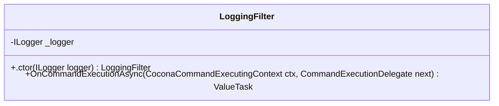

<div id="RossmannProductDto-class-diagram"></div>

##### `RossmannProductDto` class diagram

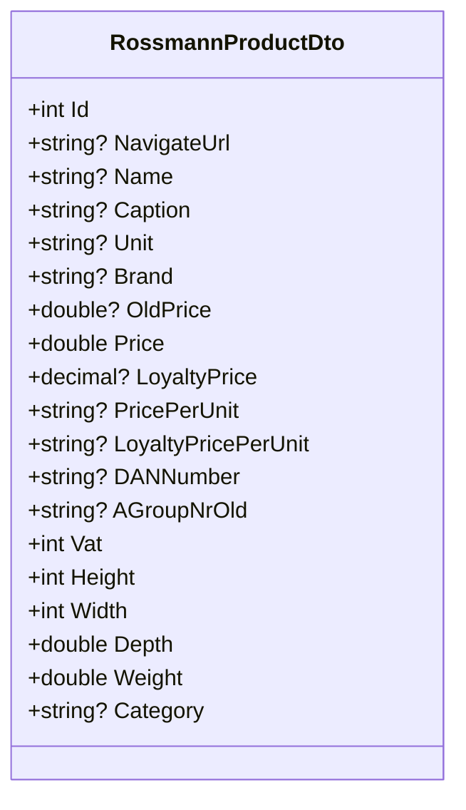

<div id="IProductsReader-class-diagram"></div>

##### `IProductsReader` class diagram

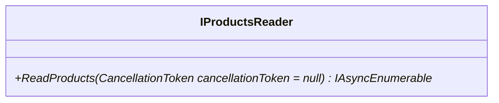

<div id="IProductsWriter-class-diagram"></div>

##### `IProductsWriter` class diagram

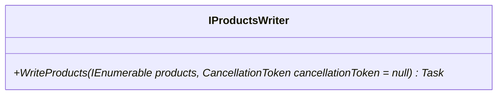

<div id="IRossmannProductsService-class-diagram"></div>

##### `IRossmannProductsService` class diagram

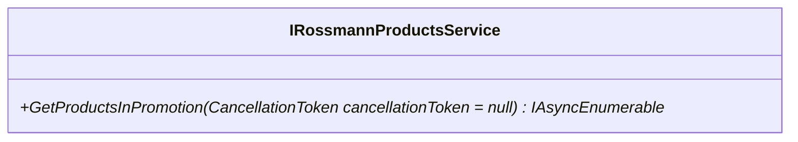

<div id="FetchRossmannProductsUseCase-class-diagram"></div>

##### `FetchRossmannProductsUseCase` class diagram

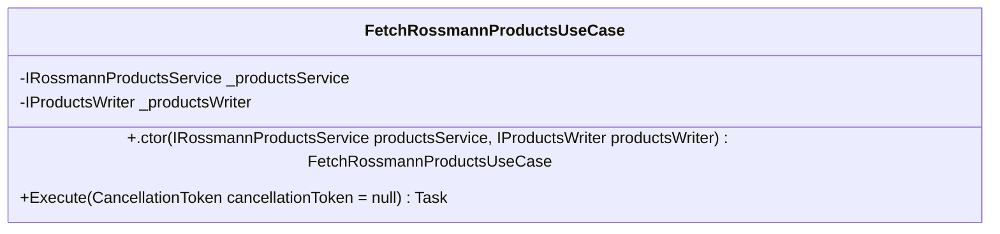

<div id="NotifyCustomerAboutPromotionsUseCase-class-diagram"></div>

##### `NotifyCustomerAboutPromotionsUseCase` class diagram

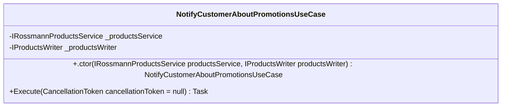

<div id="IProductsApi-class-diagram"></div>

##### `IProductsApi` class diagram

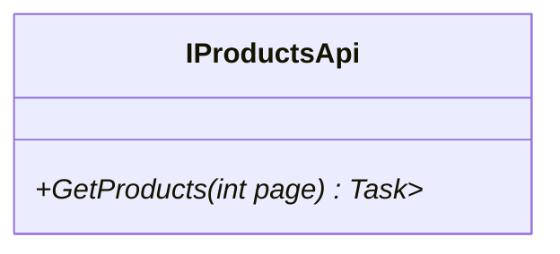

<div id="ApiProductData-class-diagram"></div>

##### `ApiProductData` class diagram

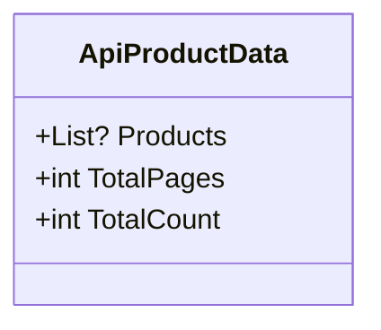

<div id="ApiProductDto-class-diagram"></div>

##### `ApiProductDto` class diagram

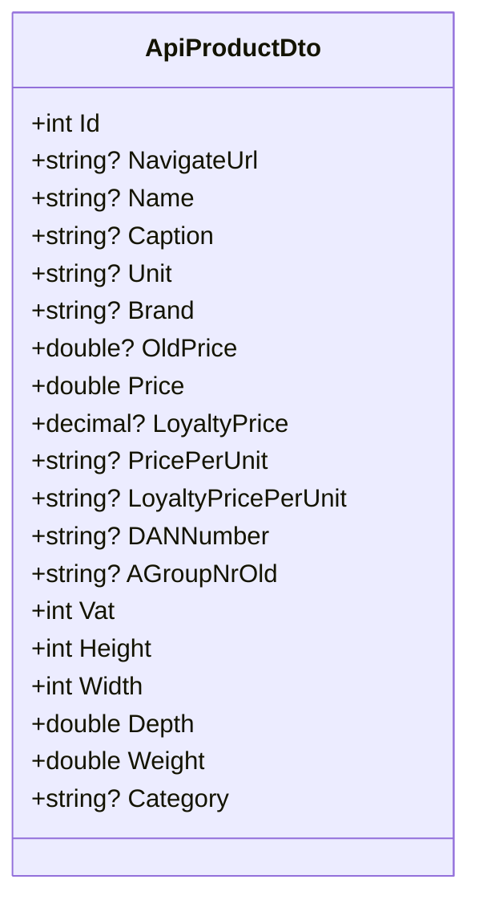

<div id="RossmannApiResponse&lt;T&gt;-class-diagram"></div>

##### `RossmannApiResponse<T>` class diagram

```mermaid
classDiagram
class RossmannApiResponse<T>{
    +T? Data
}

```

<div id="IocExtensions-class-diagram"></div>

##### `IocExtensions` class diagram

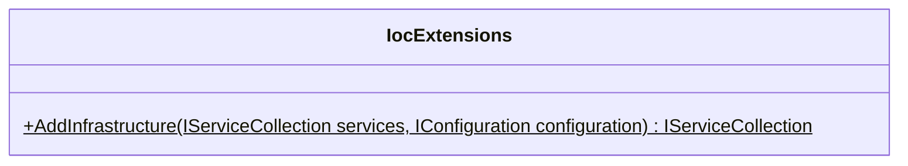

<div id="FileProductsReader-class-diagram"></div>

##### `FileProductsReader` class diagram

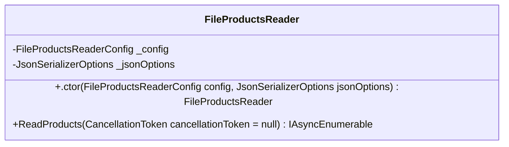

<div id="FileProductsReaderConfig-class-diagram"></div>

##### `FileProductsReaderConfig` class diagram

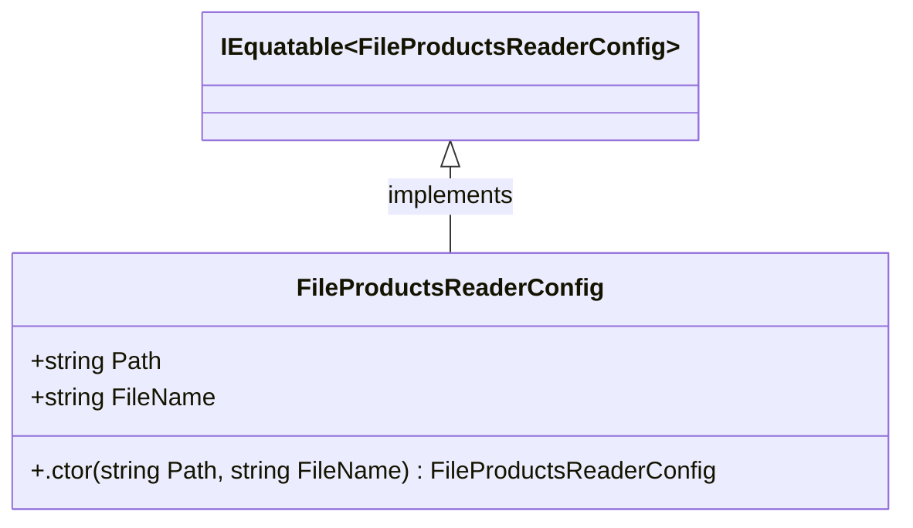

<div id="FileProductsWriter-class-diagram"></div>

##### `FileProductsWriter` class diagram

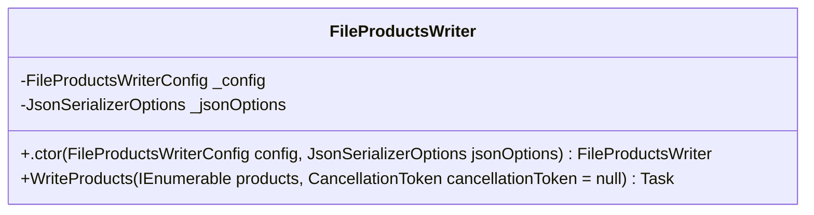

<div id="FileProductsWriterConfig-class-diagram"></div>

##### `FileProductsWriterConfig` class diagram

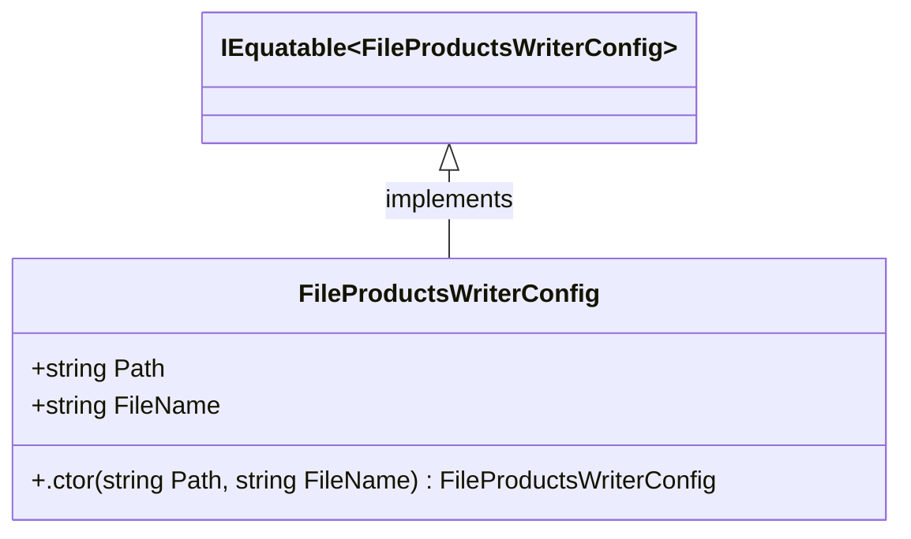

<div id="HttpRossmannProductsService-class-diagram"></div>

##### `HttpRossmannProductsService` class diagram

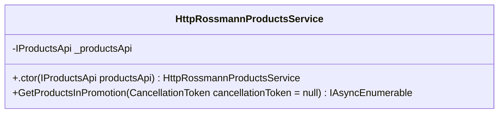

<div id="FileProductsReaderTests-class-diagram"></div>

##### `FileProductsReaderTests` class diagram

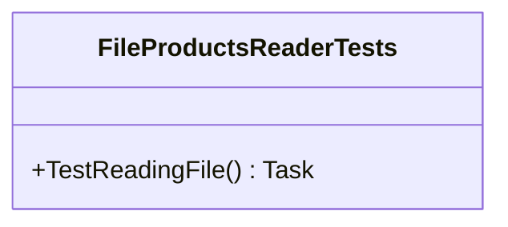

<div id="UnitTest1-class-diagram"></div>

##### `UnitTest1` class diagram

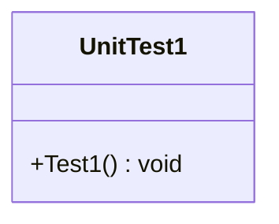

*This file is maintained by a bot.*

<!-- markdownlint-restore -->
