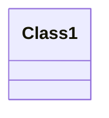
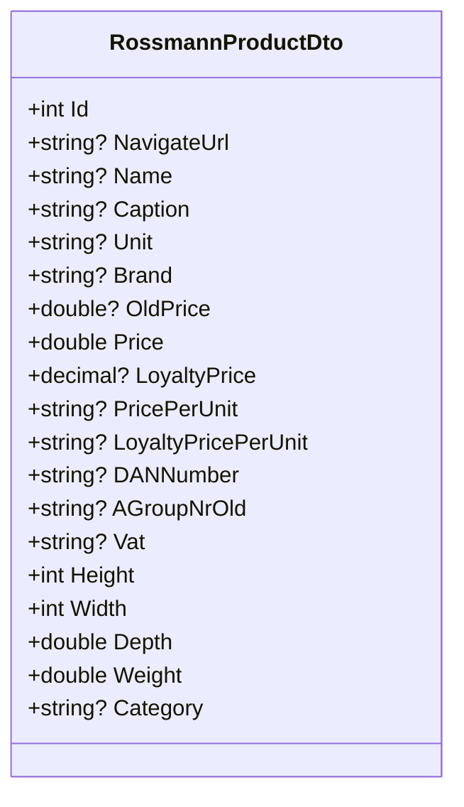
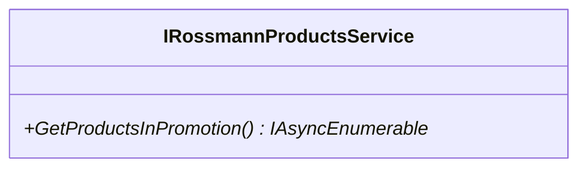
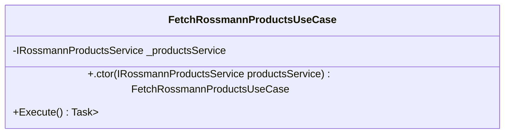
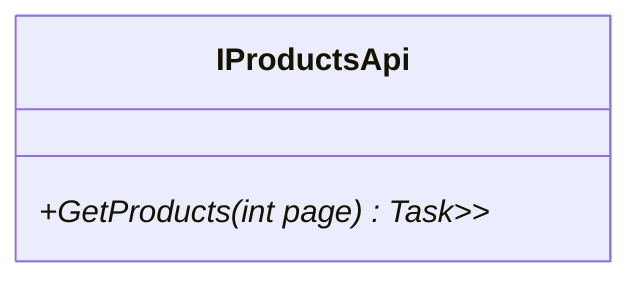
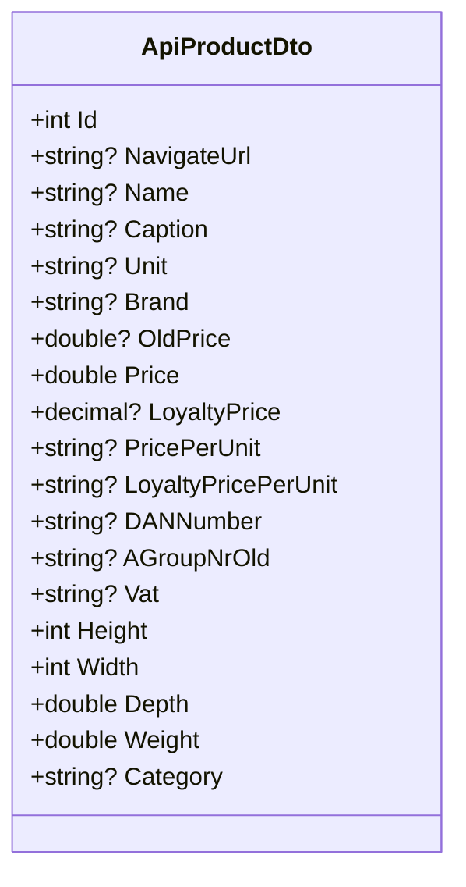
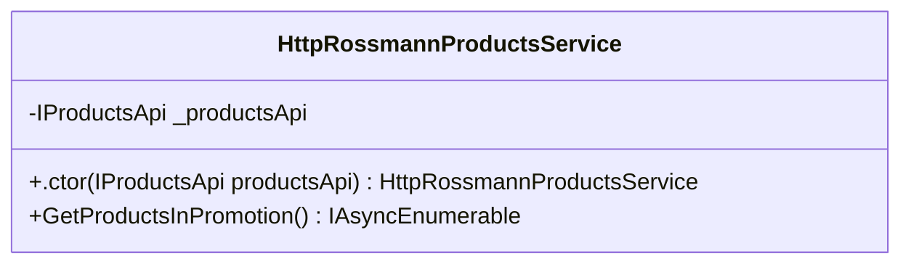

<!-- markdownlint-capture -->
<!-- markdownlint-disable -->

# Code Metrics

This file is dynamically maintained by a bot, *please do not* edit this by hand. It represents various [code metrics](https://aka.ms/dotnet/code-metrics), such as cyclomatic complexity, maintainability index, and so on.

<div id='productfetcher-core'></div>

## ProductFetcher.Core :heavy_check_mark:

The *ProductFetcher.Core.csproj* project file contains:

- 4 namespaces.
- 4 named types.
- 52 total lines of source code.
- Approximately 2 lines of executable code.
- The highest cyclomatic complexity is 2 :heavy_check_mark:.

<details>
<summary>
  <strong id="productfetcher-core">
    ProductFetcher.Core :question:
  </strong>
</summary>
<br>

The `ProductFetcher.Core` namespace contains 1 named types.

- 1 named types.
- 5 total lines of source code.
- Approximately 0 lines of executable code.
- The highest cyclomatic complexity is 0 :question:.

<details>
<summary>
  <strong id="class1">
    Class1 :question:
  </strong>
</summary>
<br>

- The `Class1` contains 0 members.
- 4 total lines of source code.
- Approximately 0 lines of executable code.
- The highest cyclomatic complexity is 0 :question:.

| Member kind | Line number | Maintainability index | Cyclomatic complexity | Depth of inheritance | Class coupling | Lines of source / executable code |
| :-: | :-: | :-: | :-: | :-: | :-: | :-: |

<a href="#Class1-class-diagram">:link: to `Class1` class diagram</a>

<a href="#productfetcher-core">:top: back to ProductFetcher.Core</a>

</details>

</details>

<details>
<summary>
  <strong id="productfetcher-core-dto">
    ProductFetcher.Core.Dto :heavy_check_mark:
  </strong>
</summary>
<br>

The `ProductFetcher.Core.Dto` namespace contains 1 named types.

- 1 named types.
- 25 total lines of source code.
- Approximately 0 lines of executable code.
- The highest cyclomatic complexity is 2 :heavy_check_mark:.

<details>
<summary>
  <strong id="rossmannproductdto">
    RossmannProductDto :heavy_check_mark:
  </strong>
</summary>
<br>

- The `RossmannProductDto` contains 19 members.
- 23 total lines of source code.
- Approximately 0 lines of executable code.
- The highest cyclomatic complexity is 2 :heavy_check_mark:.

| Member kind | Line number | Maintainability index | Cyclomatic complexity | Depth of inheritance | Class coupling | Lines of source / executable code |
| :-: | :-: | :-: | :-: | :-: | :-: | :-: |
| Property | <a href='https://github.com/dominikus1993/argo-rossmann-product-fetcher/blob/main/src/ProductFetcher.Core/Dto/ProductDto.cs#L17' title='string? RossmannProductDto.AGroupNrOld'>17</a> | 100 | 2 :heavy_check_mark: | 0 | 1 | 1 / 0 |
| Property | <a href='https://github.com/dominikus1993/argo-rossmann-product-fetcher/blob/main/src/ProductFetcher.Core/Dto/ProductDto.cs#L10' title='string? RossmannProductDto.Brand'>10</a> | 100 | 2 :heavy_check_mark: | 0 | 1 | 1 / 0 |
| Property | <a href='https://github.com/dominikus1993/argo-rossmann-product-fetcher/blob/main/src/ProductFetcher.Core/Dto/ProductDto.cs#L8' title='string? RossmannProductDto.Caption'>8</a> | 100 | 2 :heavy_check_mark: | 0 | 1 | 1 / 0 |
| Property | <a href='https://github.com/dominikus1993/argo-rossmann-product-fetcher/blob/main/src/ProductFetcher.Core/Dto/ProductDto.cs#L23' title='string? RossmannProductDto.Category'>23</a> | 100 | 2 :heavy_check_mark: | 0 | 1 | 1 / 0 |
| Property | <a href='https://github.com/dominikus1993/argo-rossmann-product-fetcher/blob/main/src/ProductFetcher.Core/Dto/ProductDto.cs#L16' title='string? RossmannProductDto.DANNumber'>16</a> | 100 | 2 :heavy_check_mark: | 0 | 1 | 1 / 0 |
| Property | <a href='https://github.com/dominikus1993/argo-rossmann-product-fetcher/blob/main/src/ProductFetcher.Core/Dto/ProductDto.cs#L21' title='double RossmannProductDto.Depth'>21</a> | 100 | 2 :heavy_check_mark: | 0 | 0 | 1 / 0 |
| Property | <a href='https://github.com/dominikus1993/argo-rossmann-product-fetcher/blob/main/src/ProductFetcher.Core/Dto/ProductDto.cs#L19' title='int RossmannProductDto.Height'>19</a> | 100 | 2 :heavy_check_mark: | 0 | 0 | 1 / 0 |
| Property | <a href='https://github.com/dominikus1993/argo-rossmann-product-fetcher/blob/main/src/ProductFetcher.Core/Dto/ProductDto.cs#L5' title='int RossmannProductDto.Id'>5</a> | 100 | 2 :heavy_check_mark: | 0 | 0 | 1 / 0 |
| Property | <a href='https://github.com/dominikus1993/argo-rossmann-product-fetcher/blob/main/src/ProductFetcher.Core/Dto/ProductDto.cs#L13' title='decimal? RossmannProductDto.LoyaltyPrice'>13</a> | 100 | 2 :heavy_check_mark: | 0 | 2 | 1 / 0 |
| Property | <a href='https://github.com/dominikus1993/argo-rossmann-product-fetcher/blob/main/src/ProductFetcher.Core/Dto/ProductDto.cs#L15' title='string? RossmannProductDto.LoyaltyPricePerUnit'>15</a> | 100 | 2 :heavy_check_mark: | 0 | 1 | 1 / 0 |
| Property | <a href='https://github.com/dominikus1993/argo-rossmann-product-fetcher/blob/main/src/ProductFetcher.Core/Dto/ProductDto.cs#L7' title='string? RossmannProductDto.Name'>7</a> | 100 | 2 :heavy_check_mark: | 0 | 1 | 1 / 0 |
| Property | <a href='https://github.com/dominikus1993/argo-rossmann-product-fetcher/blob/main/src/ProductFetcher.Core/Dto/ProductDto.cs#L6' title='string? RossmannProductDto.NavigateUrl'>6</a> | 100 | 2 :heavy_check_mark: | 0 | 1 | 1 / 0 |
| Property | <a href='https://github.com/dominikus1993/argo-rossmann-product-fetcher/blob/main/src/ProductFetcher.Core/Dto/ProductDto.cs#L11' title='double? RossmannProductDto.OldPrice'>11</a> | 100 | 2 :heavy_check_mark: | 0 | 1 | 1 / 0 |
| Property | <a href='https://github.com/dominikus1993/argo-rossmann-product-fetcher/blob/main/src/ProductFetcher.Core/Dto/ProductDto.cs#L12' title='double RossmannProductDto.Price'>12</a> | 100 | 2 :heavy_check_mark: | 0 | 0 | 1 / 0 |
| Property | <a href='https://github.com/dominikus1993/argo-rossmann-product-fetcher/blob/main/src/ProductFetcher.Core/Dto/ProductDto.cs#L14' title='string? RossmannProductDto.PricePerUnit'>14</a> | 100 | 2 :heavy_check_mark: | 0 | 1 | 1 / 0 |
| Property | <a href='https://github.com/dominikus1993/argo-rossmann-product-fetcher/blob/main/src/ProductFetcher.Core/Dto/ProductDto.cs#L9' title='string? RossmannProductDto.Unit'>9</a> | 100 | 2 :heavy_check_mark: | 0 | 1 | 1 / 0 |
| Property | <a href='https://github.com/dominikus1993/argo-rossmann-product-fetcher/blob/main/src/ProductFetcher.Core/Dto/ProductDto.cs#L18' title='string? RossmannProductDto.Vat'>18</a> | 100 | 2 :heavy_check_mark: | 0 | 1 | 1 / 0 |
| Property | <a href='https://github.com/dominikus1993/argo-rossmann-product-fetcher/blob/main/src/ProductFetcher.Core/Dto/ProductDto.cs#L22' title='double RossmannProductDto.Weight'>22</a> | 100 | 2 :heavy_check_mark: | 0 | 0 | 1 / 0 |
| Property | <a href='https://github.com/dominikus1993/argo-rossmann-product-fetcher/blob/main/src/ProductFetcher.Core/Dto/ProductDto.cs#L20' title='int RossmannProductDto.Width'>20</a> | 100 | 2 :heavy_check_mark: | 0 | 0 | 1 / 0 |

<a href="#RossmannProductDto-class-diagram">:link: to `RossmannProductDto` class diagram</a>

<a href="#productfetcher-core-dto">:top: back to ProductFetcher.Core.Dto</a>

</details>

</details>

<details>
<summary>
  <strong id="productfetcher-core-services">
    ProductFetcher.Core.Services :heavy_check_mark:
  </strong>
</summary>
<br>

The `ProductFetcher.Core.Services` namespace contains 1 named types.

- 1 named types.
- 6 total lines of source code.
- Approximately 0 lines of executable code.
- The highest cyclomatic complexity is 1 :heavy_check_mark:.

<details>
<summary>
  <strong id="irossmannproductsservice">
    IRossmannProductsService :heavy_check_mark:
  </strong>
</summary>
<br>

- The `IRossmannProductsService` contains 1 members.
- 4 total lines of source code.
- Approximately 0 lines of executable code.
- The highest cyclomatic complexity is 1 :heavy_check_mark:.

| Member kind | Line number | Maintainability index | Cyclomatic complexity | Depth of inheritance | Class coupling | Lines of source / executable code |
| :-: | :-: | :-: | :-: | :-: | :-: | :-: |
| Method | <a href='https://github.com/dominikus1993/argo-rossmann-product-fetcher/blob/main/src/ProductFetcher.Core/Services/RossmannProductsService.cs#L7' title='IAsyncEnumerable<RossmannProductDto> IRossmannProductsService.GetProductsInPromotion()'>7</a> | 100 | 1 :heavy_check_mark: | 0 | 2 | 1 / 0 |

<a href="#IRossmannProductsService-class-diagram">:link: to `IRossmannProductsService` class diagram</a>

<a href="#productfetcher-core-services">:top: back to ProductFetcher.Core.Services</a>

</details>

</details>

<details>
<summary>
  <strong id="productfetcher-core-usecases">
    ProductFetcher.Core.UseCases :heavy_check_mark:
  </strong>
</summary>
<br>

The `ProductFetcher.Core.UseCases` namespace contains 1 named types.

- 1 named types.
- 16 total lines of source code.
- Approximately 2 lines of executable code.
- The highest cyclomatic complexity is 1 :heavy_check_mark:.

<details>
<summary>
  <strong id="fetchrossmannproductsusecase">
    FetchRossmannProductsUseCase :heavy_check_mark:
  </strong>
</summary>
<br>

- The `FetchRossmannProductsUseCase` contains 3 members.
- 14 total lines of source code.
- Approximately 2 lines of executable code.
- The highest cyclomatic complexity is 1 :heavy_check_mark:.

| Member kind | Line number | Maintainability index | Cyclomatic complexity | Depth of inheritance | Class coupling | Lines of source / executable code |
| :-: | :-: | :-: | :-: | :-: | :-: | :-: |
| Field | <a href='https://github.com/dominikus1993/argo-rossmann-product-fetcher/blob/main/src/ProductFetcher.Core/UseCases/FetchProductsUseCase.cs#L8' title='IRossmannProductsService FetchRossmannProductsUseCase._productsService'>8</a> | 100 | 0 :heavy_check_mark: | 0 | 1 | 1 / 0 |
| Method | <a href='https://github.com/dominikus1993/argo-rossmann-product-fetcher/blob/main/src/ProductFetcher.Core/UseCases/FetchProductsUseCase.cs#L10' title='FetchRossmannProductsUseCase.FetchRossmannProductsUseCase(IRossmannProductsService productsService)'>10</a> | 96 | 1 :heavy_check_mark: | 0 | 1 | 4 / 1 |
| Method | <a href='https://github.com/dominikus1993/argo-rossmann-product-fetcher/blob/main/src/ProductFetcher.Core/UseCases/FetchProductsUseCase.cs#L15' title='Task<List<RossmannProductDto>> FetchRossmannProductsUseCase.Execute()'>15</a> | 94 | 1 :heavy_check_mark: | 0 | 6 | 4 / 1 |

<a href="#FetchRossmannProductsUseCase-class-diagram">:link: to `FetchRossmannProductsUseCase` class diagram</a>

<a href="#productfetcher-core-usecases">:top: back to ProductFetcher.Core.UseCases</a>

</details>

</details>

<a href="#productfetcher-core">:top: back to ProductFetcher.Core</a>

<div id='productfetcher-infrastructure'></div>

## ProductFetcher.Infrastructure :heavy_check_mark:

The *ProductFetcher.Infrastructure.csproj* project file contains:

- 4 namespaces.
- 5 named types.
- 70 total lines of source code.
- Approximately 11 lines of executable code.
- The highest cyclomatic complexity is 6 :heavy_check_mark:.

<details>
<summary>
  <strong id="productfetcher-infrastructure-api">
    ProductFetcher.Infrastructure.Api :heavy_check_mark:
  </strong>
</summary>
<br>

The `ProductFetcher.Infrastructure.Api` namespace contains 1 named types.

- 1 named types.
- 8 total lines of source code.
- Approximately 2 lines of executable code.
- The highest cyclomatic complexity is 1 :heavy_check_mark:.

<details>
<summary>
  <strong id="iproductsapi">
    IProductsApi :heavy_check_mark:
  </strong>
</summary>
<br>

- The `IProductsApi` contains 1 members.
- 5 total lines of source code.
- Approximately 2 lines of executable code.
- The highest cyclomatic complexity is 1 :heavy_check_mark:.

| Member kind | Line number | Maintainability index | Cyclomatic complexity | Depth of inheritance | Class coupling | Lines of source / executable code |
| :-: | :-: | :-: | :-: | :-: | :-: | :-: |
| Method | <a href='https://github.com/dominikus1993/argo-rossmann-product-fetcher/blob/main/src/ProductFetcher.Infrastructure/Api/IProductsApi.cs#L7' title='Task<RossmannApiResponse<List<ApiProductDto>>> IProductsApi.GetProducts(int page)'>7</a> | 93 | 1 :heavy_check_mark: | 0 | 5 | 2 / 2 |

<a href="#IProductsApi-class-diagram">:link: to `IProductsApi` class diagram</a>

<a href="#productfetcher-infrastructure-api">:top: back to ProductFetcher.Infrastructure.Api</a>

</details>

</details>

<details>
<summary>
  <strong id="productfetcher-infrastructure-dto">
    ProductFetcher.Infrastructure.Dto :heavy_check_mark:
  </strong>
</summary>
<br>

The `ProductFetcher.Infrastructure.Dto` namespace contains 2 named types.

- 2 named types.
- 28 total lines of source code.
- Approximately 0 lines of executable code.
- The highest cyclomatic complexity is 2 :heavy_check_mark:.

<details>
<summary>
  <strong id="apiproductdto">
    ApiProductDto :heavy_check_mark:
  </strong>
</summary>
<br>

- The `ApiProductDto` contains 19 members.
- 22 total lines of source code.
- Approximately 0 lines of executable code.
- The highest cyclomatic complexity is 2 :heavy_check_mark:.

| Member kind | Line number | Maintainability index | Cyclomatic complexity | Depth of inheritance | Class coupling | Lines of source / executable code |
| :-: | :-: | :-: | :-: | :-: | :-: | :-: |
| Property | <a href='https://github.com/dominikus1993/argo-rossmann-product-fetcher/blob/main/src/ProductFetcher.Infrastructure/Dto/ProductResponse.cs#L22' title='string? ApiProductDto.AGroupNrOld'>22</a> | 100 | 2 :heavy_check_mark: | 0 | 1 | 1 / 0 |
| Property | <a href='https://github.com/dominikus1993/argo-rossmann-product-fetcher/blob/main/src/ProductFetcher.Infrastructure/Dto/ProductResponse.cs#L15' title='string? ApiProductDto.Brand'>15</a> | 100 | 2 :heavy_check_mark: | 0 | 1 | 1 / 0 |
| Property | <a href='https://github.com/dominikus1993/argo-rossmann-product-fetcher/blob/main/src/ProductFetcher.Infrastructure/Dto/ProductResponse.cs#L13' title='string? ApiProductDto.Caption'>13</a> | 100 | 2 :heavy_check_mark: | 0 | 1 | 1 / 0 |
| Property | <a href='https://github.com/dominikus1993/argo-rossmann-product-fetcher/blob/main/src/ProductFetcher.Infrastructure/Dto/ProductResponse.cs#L28' title='string? ApiProductDto.Category'>28</a> | 100 | 2 :heavy_check_mark: | 0 | 1 | 1 / 0 |
| Property | <a href='https://github.com/dominikus1993/argo-rossmann-product-fetcher/blob/main/src/ProductFetcher.Infrastructure/Dto/ProductResponse.cs#L21' title='string? ApiProductDto.DANNumber'>21</a> | 100 | 2 :heavy_check_mark: | 0 | 1 | 1 / 0 |
| Property | <a href='https://github.com/dominikus1993/argo-rossmann-product-fetcher/blob/main/src/ProductFetcher.Infrastructure/Dto/ProductResponse.cs#L26' title='double ApiProductDto.Depth'>26</a> | 100 | 2 :heavy_check_mark: | 0 | 0 | 1 / 0 |
| Property | <a href='https://github.com/dominikus1993/argo-rossmann-product-fetcher/blob/main/src/ProductFetcher.Infrastructure/Dto/ProductResponse.cs#L24' title='int ApiProductDto.Height'>24</a> | 100 | 2 :heavy_check_mark: | 0 | 0 | 1 / 0 |
| Property | <a href='https://github.com/dominikus1993/argo-rossmann-product-fetcher/blob/main/src/ProductFetcher.Infrastructure/Dto/ProductResponse.cs#L10' title='int ApiProductDto.Id'>10</a> | 100 | 2 :heavy_check_mark: | 0 | 0 | 1 / 0 |
| Property | <a href='https://github.com/dominikus1993/argo-rossmann-product-fetcher/blob/main/src/ProductFetcher.Infrastructure/Dto/ProductResponse.cs#L18' title='decimal? ApiProductDto.LoyaltyPrice'>18</a> | 100 | 2 :heavy_check_mark: | 0 | 2 | 1 / 0 |
| Property | <a href='https://github.com/dominikus1993/argo-rossmann-product-fetcher/blob/main/src/ProductFetcher.Infrastructure/Dto/ProductResponse.cs#L20' title='string? ApiProductDto.LoyaltyPricePerUnit'>20</a> | 100 | 2 :heavy_check_mark: | 0 | 1 | 1 / 0 |
| Property | <a href='https://github.com/dominikus1993/argo-rossmann-product-fetcher/blob/main/src/ProductFetcher.Infrastructure/Dto/ProductResponse.cs#L12' title='string? ApiProductDto.Name'>12</a> | 100 | 2 :heavy_check_mark: | 0 | 1 | 1 / 0 |
| Property | <a href='https://github.com/dominikus1993/argo-rossmann-product-fetcher/blob/main/src/ProductFetcher.Infrastructure/Dto/ProductResponse.cs#L11' title='string? ApiProductDto.NavigateUrl'>11</a> | 100 | 2 :heavy_check_mark: | 0 | 1 | 1 / 0 |
| Property | <a href='https://github.com/dominikus1993/argo-rossmann-product-fetcher/blob/main/src/ProductFetcher.Infrastructure/Dto/ProductResponse.cs#L16' title='double? ApiProductDto.OldPrice'>16</a> | 100 | 2 :heavy_check_mark: | 0 | 1 | 1 / 0 |
| Property | <a href='https://github.com/dominikus1993/argo-rossmann-product-fetcher/blob/main/src/ProductFetcher.Infrastructure/Dto/ProductResponse.cs#L17' title='double ApiProductDto.Price'>17</a> | 100 | 2 :heavy_check_mark: | 0 | 0 | 1 / 0 |
| Property | <a href='https://github.com/dominikus1993/argo-rossmann-product-fetcher/blob/main/src/ProductFetcher.Infrastructure/Dto/ProductResponse.cs#L19' title='string? ApiProductDto.PricePerUnit'>19</a> | 100 | 2 :heavy_check_mark: | 0 | 1 | 1 / 0 |
| Property | <a href='https://github.com/dominikus1993/argo-rossmann-product-fetcher/blob/main/src/ProductFetcher.Infrastructure/Dto/ProductResponse.cs#L14' title='string? ApiProductDto.Unit'>14</a> | 100 | 2 :heavy_check_mark: | 0 | 1 | 1 / 0 |
| Property | <a href='https://github.com/dominikus1993/argo-rossmann-product-fetcher/blob/main/src/ProductFetcher.Infrastructure/Dto/ProductResponse.cs#L23' title='string? ApiProductDto.Vat'>23</a> | 100 | 2 :heavy_check_mark: | 0 | 1 | 1 / 0 |
| Property | <a href='https://github.com/dominikus1993/argo-rossmann-product-fetcher/blob/main/src/ProductFetcher.Infrastructure/Dto/ProductResponse.cs#L27' title='double ApiProductDto.Weight'>27</a> | 100 | 2 :heavy_check_mark: | 0 | 0 | 1 / 0 |
| Property | <a href='https://github.com/dominikus1993/argo-rossmann-product-fetcher/blob/main/src/ProductFetcher.Infrastructure/Dto/ProductResponse.cs#L25' title='int ApiProductDto.Width'>25</a> | 100 | 2 :heavy_check_mark: | 0 | 0 | 1 / 0 |

<a href="#ApiProductDto-class-diagram">:link: to `ApiProductDto` class diagram</a>

<a href="#productfetcher-infrastructure-dto">:top: back to ProductFetcher.Infrastructure.Dto</a>

</details>

<details>
<summary>
  <strong id="rossmannapiresponset">
    RossmannApiResponse&lt;T&gt; :heavy_check_mark:
  </strong>
</summary>
<br>

- The `RossmannApiResponse<T>` contains 1 members.
- 4 total lines of source code.
- Approximately 0 lines of executable code.
- The highest cyclomatic complexity is 2 :heavy_check_mark:.

| Member kind | Line number | Maintainability index | Cyclomatic complexity | Depth of inheritance | Class coupling | Lines of source / executable code |
| :-: | :-: | :-: | :-: | :-: | :-: | :-: |
| Property | <a href='https://github.com/dominikus1993/argo-rossmann-product-fetcher/blob/main/src/ProductFetcher.Infrastructure/Dto/ProductResponse.cs#L5' title='T? RossmannApiResponse<T>.Data'>5</a> | 100 | 2 :heavy_check_mark: | 0 | 0 | 1 / 0 |

<a href="#RossmannApiResponse&lt;T&gt;-class-diagram">:link: to `RossmannApiResponse&lt;T&gt;` class diagram</a>

<a href="#productfetcher-infrastructure-dto">:top: back to ProductFetcher.Infrastructure.Dto</a>

</details>

</details>

<details>
<summary>
  <strong id="productfetcher-infrastructure">
    ProductFetcher.Infrastructure :question:
  </strong>
</summary>
<br>

The `ProductFetcher.Infrastructure` namespace contains 1 named types.

- 1 named types.
- 5 total lines of source code.
- Approximately 0 lines of executable code.
- The highest cyclomatic complexity is 0 :question:.

<details>
<summary>
  <strong id="class1">
    Class1 :question:
  </strong>
</summary>
<br>

- The `Class1` contains 0 members.
- 4 total lines of source code.
- Approximately 0 lines of executable code.
- The highest cyclomatic complexity is 0 :question:.

| Member kind | Line number | Maintainability index | Cyclomatic complexity | Depth of inheritance | Class coupling | Lines of source / executable code |
| :-: | :-: | :-: | :-: | :-: | :-: | :-: |

<a href="#Class1-class-diagram">:link: to `Class1` class diagram</a>

<a href="#productfetcher-infrastructure">:top: back to ProductFetcher.Infrastructure</a>

</details>

</details>

<details>
<summary>
  <strong id="productfetcher-infrastructure-services">
    ProductFetcher.Infrastructure.Services :heavy_check_mark:
  </strong>
</summary>
<br>

The `ProductFetcher.Infrastructure.Services` namespace contains 1 named types.

- 1 named types.
- 29 total lines of source code.
- Approximately 9 lines of executable code.
- The highest cyclomatic complexity is 6 :heavy_check_mark:.

<details>
<summary>
  <strong id="httprossmannproductsservice">
    HttpRossmannProductsService :heavy_check_mark:
  </strong>
</summary>
<br>

- The `HttpRossmannProductsService` contains 3 members.
- 27 total lines of source code.
- Approximately 9 lines of executable code.
- The highest cyclomatic complexity is 6 :heavy_check_mark:.

| Member kind | Line number | Maintainability index | Cyclomatic complexity | Depth of inheritance | Class coupling | Lines of source / executable code |
| :-: | :-: | :-: | :-: | :-: | :-: | :-: |
| Field | <a href='https://github.com/dominikus1993/argo-rossmann-product-fetcher/blob/main/src/ProductFetcher.Infrastructure/Services/HttpRossmannProductsService.cs#L12' title='IProductsApi HttpRossmannProductsService._productsApi'>12</a> | 100 | 0 :heavy_check_mark: | 0 | 1 | 1 / 0 |
| Method | <a href='https://github.com/dominikus1993/argo-rossmann-product-fetcher/blob/main/src/ProductFetcher.Infrastructure/Services/HttpRossmannProductsService.cs#L14' title='HttpRossmannProductsService.HttpRossmannProductsService(IProductsApi productsApi)'>14</a> | 96 | 1 :heavy_check_mark: | 0 | 1 | 4 / 1 |
| Method | <a href='https://github.com/dominikus1993/argo-rossmann-product-fetcher/blob/main/src/ProductFetcher.Infrastructure/Services/HttpRossmannProductsService.cs#L19' title='IAsyncEnumerable<RossmannProductDto> HttpRossmannProductsService.GetProductsInPromotion()'>19</a> | 66 | 6 :heavy_check_mark: | 0 | 9 | 17 / 8 |

<a href="#HttpRossmannProductsService-class-diagram">:link: to `HttpRossmannProductsService` class diagram</a>

<a href="#productfetcher-infrastructure-services">:top: back to ProductFetcher.Infrastructure.Services</a>

</details>

</details>

<a href="#productfetcher-infrastructure">:top: back to ProductFetcher.Infrastructure</a>

## Metric definitions

  - **Maintainability index**: Measures ease of code maintenance. Higher values are better.
  - **Cyclomatic complexity**: Measures the number of branches. Lower values are better.
  - **Depth of inheritance**: Measures length of object inheritance hierarchy. Lower values are better.
  - **Class coupling**: Measures the number of classes that are referenced. Lower values are better.
  - **Lines of source code**: Exact number of lines of source code. Lower values are better.
  - **Lines of executable code**: Approximates the lines of executable code. Lower values are better.

## Mermaid class diagrams

<div id="Class1-class-diagram"></div>

##### `Class1` class diagram



<div id="RossmannProductDto-class-diagram"></div>

##### `RossmannProductDto` class diagram



<div id="IRossmannProductsService-class-diagram"></div>

##### `IRossmannProductsService` class diagram



<div id="FetchRossmannProductsUseCase-class-diagram"></div>

##### `FetchRossmannProductsUseCase` class diagram



<div id="IProductsApi-class-diagram"></div>

##### `IProductsApi` class diagram



<div id="ApiProductDto-class-diagram"></div>

##### `ApiProductDto` class diagram



<div id="RossmannApiResponse&lt;T&gt;-class-diagram"></div>

##### `RossmannApiResponse<T>` class diagram

```mermaid
classDiagram
class RossmannApiResponse<T>{
    +T? Data
}

```

<div id="Class1-class-diagram"></div>

##### `Class1` class diagram


<div id="HttpRossmannProductsService-class-diagram"></div>

##### `HttpRossmannProductsService` class diagram



*This file is maintained by a bot.*

<!-- markdownlint-restore -->
